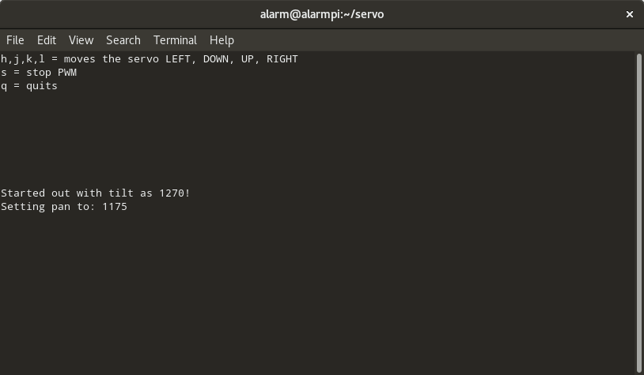
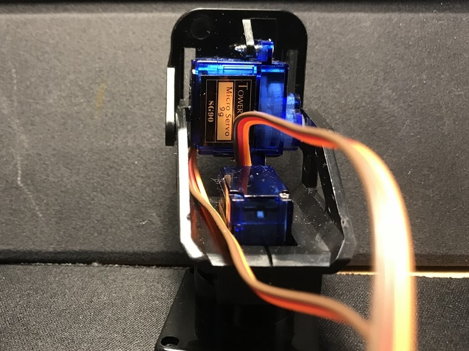
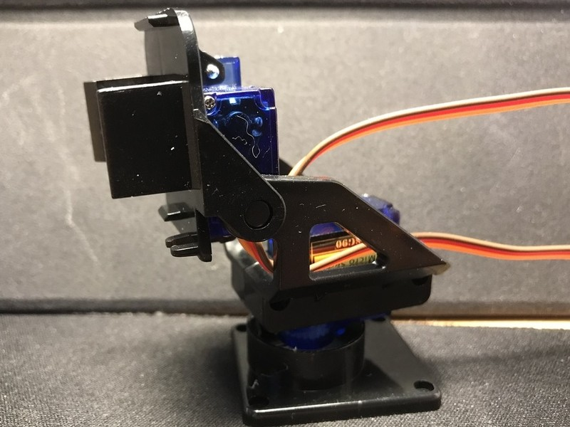
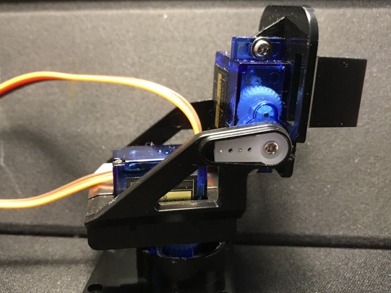
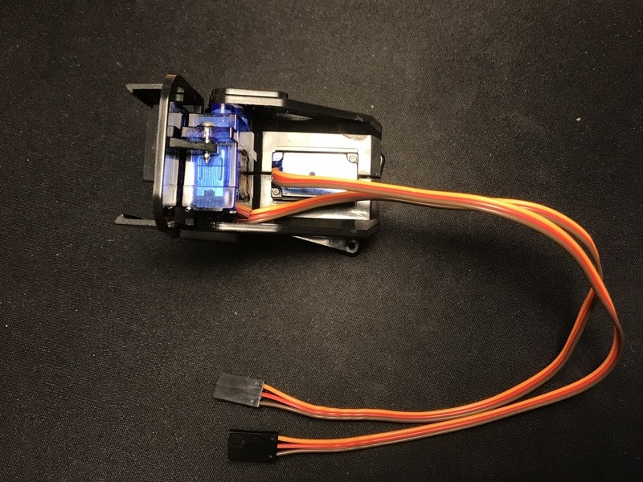
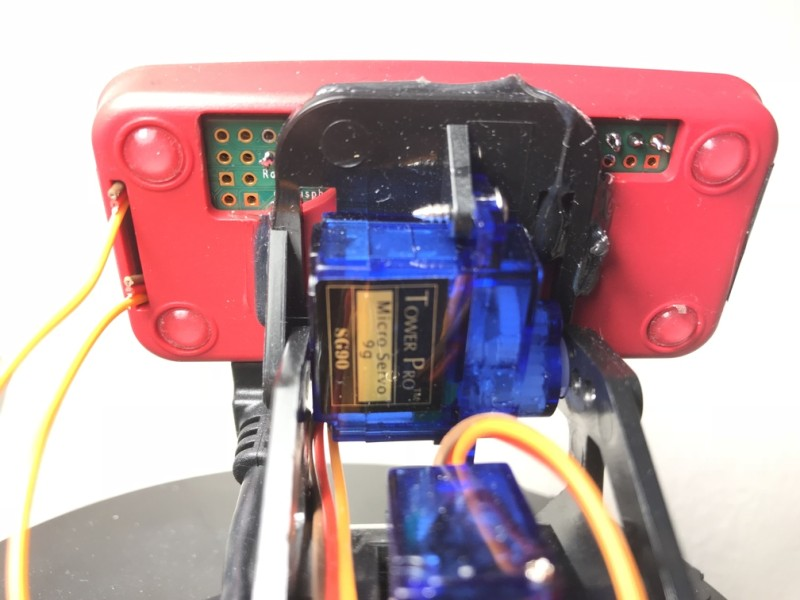
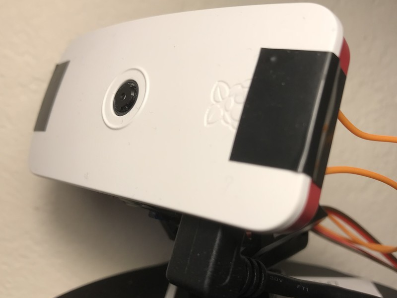
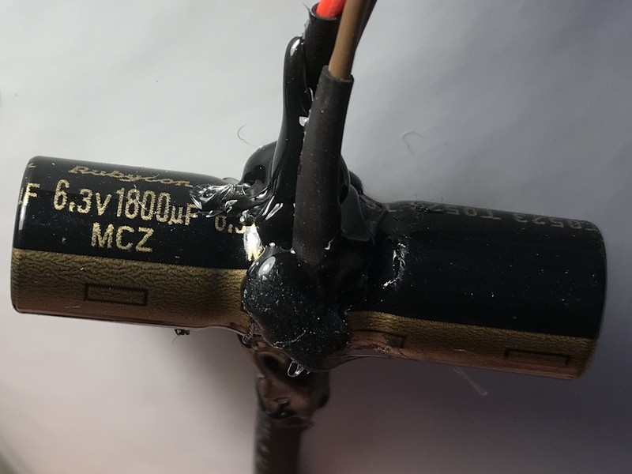

# ServoControl

This is a small program to control a couple of servo motors directly connected to two PWM output signals on the Raspberry Pi Zero W.

I'm using [Arch Linux ARM](https://archlinuxarm.org/) as my Linux distribution, but I assume that it'll compile under other distributions too.
If you compile for another distribution, feel free to update with instructions.

### Prerequisites
1. A couple of servos, possibly with a pan and tilt kit. I bought mine on Ebay ([this kit from ms_graphics](https://www.ebay.co.uk/itm/263327419556)).
1. A Raspberry Pi Zero W, as it's handy to control the camera wirelessly
1. A separate power supply for servo and Raspberry. Seriously, it is absolutely essential! Make sure that the GND is the same on the supplies though. I am using a power supply with two USB outputs
1. That the Pan servo is connected to GPIO 18 and the Tilt servo is on GPIO 19 (pins 12 and 35 respectively)

### Assumptions
That you...
1. ... are confident installing software on your OS of choice
1. ... know how to change directories, running programs etc.
1. ... have the base-devel and git packages installed (`sudo pacman -S base-devel git`)
1. ... are able to run `sudo` (check out the [wiki](https://wiki.archlinux.org/index.php/sudo) for how to set that up)

## Libraries
Make sure that you have all the libraries necessary to build this. The program uses ncurses, rt and pigpio.

The excellent [PiGPIO library](http://abyz.me.uk/rpi/pigpio/) isn't installed in Arch Linux ARM and I don't think there's an AUR for the C-bindings. I just installed it myself as it's straight-forward enough:
```bash
git clone https://github.com/joan2937/pigpio
cd pigpio
```

Edit the Makefile to use */usr* instead of */usr/local* if you're on Arch (line starting with **prefix**), make the library and install it:
```bash
sed -i -e 's/\(prefix = \/usr\)\/local/\1/' Makefile
make
sudo make install
```

## How to build
It should just be to clone this repository and build the program:
```bash
git clone https://github.com/nolltre/ServoControl.git
cd ServoControl
make
```

If you are using another GPIO, adjust that in the `servo.c` file.

## How to run
If you haven't changed any permissions for accessing the GPIOs, you will need to run the program as root:
```bash
sudo ./servo
```

## Controls
* `h, j, k, l` moves the servo left, up, down and right
* `s` stops the PWM signal (0% duty cycle)
* `q` quits the program


## So how does it look?
These are just some images showing how your kit might turn out. I removed some of the plastic tabs on the pan & tilt kit and hotglued the official Raspberry Pi Zero case.

|Image|
|-----|
||
||
||
||
||
||
||
